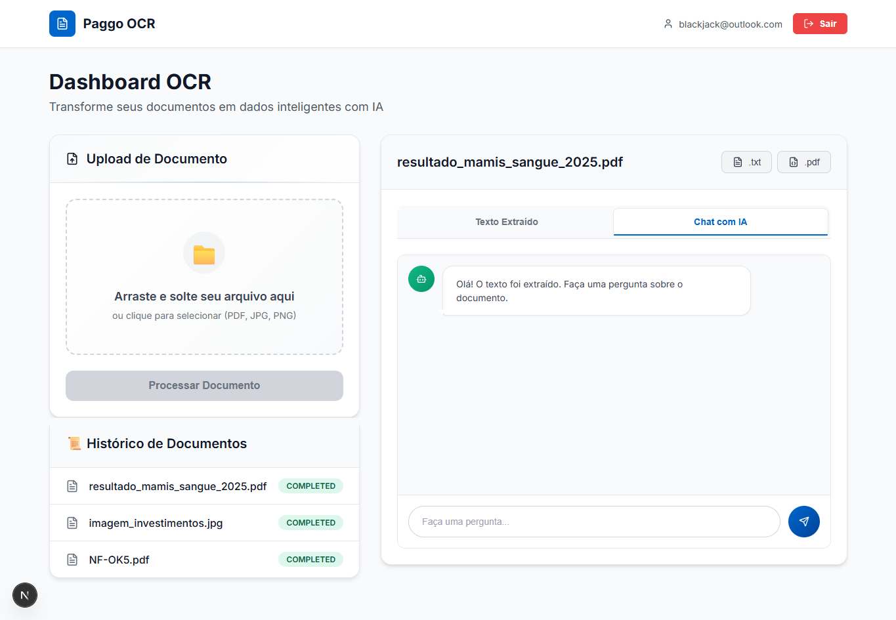
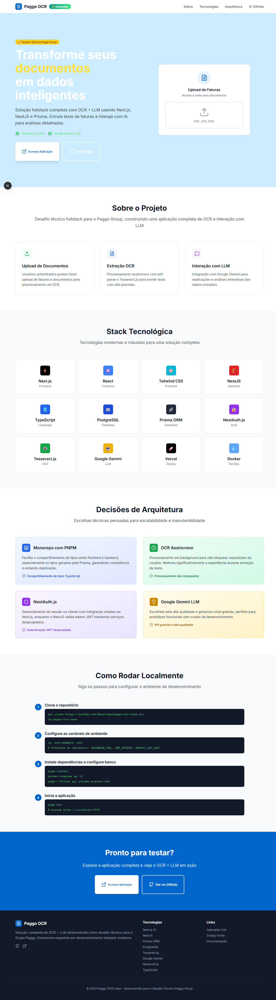
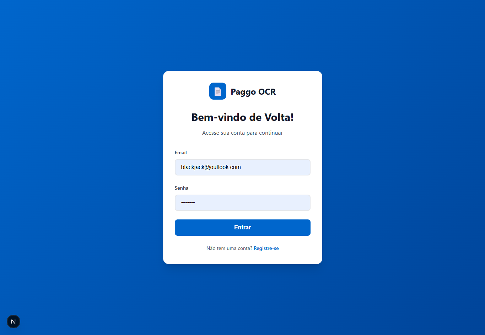

# Paggo - OCR Case


> Desafio técnico fullstack para o Paggo Group, construindo uma aplicação de OCR e interação com LLM usando Next.js, NestJS e Prisma.

## 🚀 Link para a Aplicação

**Você pode acessar a aplicação deployada aqui: [https://futurolink.com](https://link-futuro)**

---

## 📋 Índice

* [Sobre o Projeto](#-sobre-o-projeto)
* [✨ Demonstração](#-demonstração)  
* [Tecnologias Utilizadas](#-tecnologias-utilizadas)
* [Como Rodar o Projeto Localmente](#-como-rodar-o-projeto-localmente)
* [Decisões de Arquitetura](#-decisões-de-arquitetura)

---

## ✨ Demonstração

A aplicação possui um fluxo completo, desde uma landing page de apresentação até um dashboard funcional e interativo.

### Dashboard Principal
*A tela principal da aplicação, onde o usuário faz o upload de documentos, visualiza o histórico e interage com os resultados.*


<details>
<summary>Clique para ver mais telas (Homepage e Autenticação)</summary>

### Homepage
*Landing page com a apresentação do projeto, tecnologias e arquitetura.*


### Telas de Autenticação
*Fluxo de registro e login com feedback visual para o usuário.*



</details>

---

## 📖 Sobre o Projeto

Este projeto implementa uma solução que permite aos usuários autenticados fazerem upload de documentos (como faturas), extrair o texto via OCR e interagir com um modelo de linguagem (LLM) para obter explicações e informações sobre os dados extraídos.

---

## ✨ Tecnologias Utilizadas

Este projeto foi desenvolvido com as seguintes tecnologias:

* **Frontend:** Next.js, React, Tailwind CSS
* **Backend:** NestJS, TypeScript
* **Banco de Dados:** PostgreSQL (via Prisma ORM)
* **Autenticação:** NextAuth.js (com JWT)
* **OCR:** Tesseract.js
* **LLM:** Google Gemini API
* **Deployment:** Vercel

---

## ⚙️ Como Rodar o Projeto Localmente

Siga os passos abaixo para configurar e rodar o projeto em seu ambiente local.

**Pré-requisitos:**
* [Node.js](https://nodejs.org/) (versão LTS)
* [pnpm](https://pnpm.io/installation)
* [Docker](https://www.docker.com/) (para o banco de dados)

**Passo a passo:**

1.  **Clone o repositório:**
    ```bash
    git clone [https://github.com/Manelima/paggo-ocr-case.git](https://github.com/Manelima/paggo-ocr-case.git)
    cd paggo-ocr-case
    ```

2.  **Configure as Variáveis de Ambiente:**
    * Na raiz do projeto, crie um arquivo `.env` a partir do exemplo:
        ```bash
        cp .env.example .env
        ```
    * Abra o arquivo .env e preencha todas as variáveis necessárias (URL do banco, segredos de JWT, chave da API do Google Gemini, etc.).

3.  **Instale as dependências:**
    ```bash
    pnpm install
    ```

4.  **Suba o banco de dados (se usar Docker):**
    ```bash
    docker-compose up -d
    ```

5.  **Aplique as migrações do banco de dados:**
    ```bash
    pnpm --filter api prisma migrate dev
    ```
    *O filtro `--filter api` garante que o comando rode apenas no projeto do backend.*

6.  **Inicie a aplicação:**
    ```bash
    pnpm dev
    ```
    *Este comando irá iniciar tanto o frontend quanto o backend em modo de desenvolvimento.*

7.  Acesse `http://localhost:3000` em seu navegador.

---

## 🧠 Decisões de Arquitetura (Opcional, mas impressiona!)

* **Monorepo com PNPM Workspaces:** Escolhi esta abordagem para facilitar o compartilhamento de tipos (especialmente os tipos gerados pelo Prisma) entre o frontend e o backend, garantindo consistência e evitando duplicação de código.
* **Processamento Assíncrono de OCR:** A extração de texto é uma tarefa demorada. Para não bloquear a requisição do usuário, o processo é executado em background (ex: usando filas com BullMQ ou uma simples `Promise`), melhorando a experiência do usuário.
* **Autenticação com NextAuth.js:** Optei por gerenciar a sessão no lado do cliente com NextAuth.js pela sua simplicidade de integração com o ecossistema Next.js, enquanto o backend NestJS apenas valida os tokens JWT, mantendo os serviços desacoplados.
* **Escolha do LLM (Google Gemini):** Para a integração com o LLM, optei pela API do Google Gemini devido à sua alta qualidade e ao seu generoso nível de acesso gratuito, que se alinha perfeitamente aos requisitos de um protótipo funcional sem incorrer em custos de desenvolvimento.

---